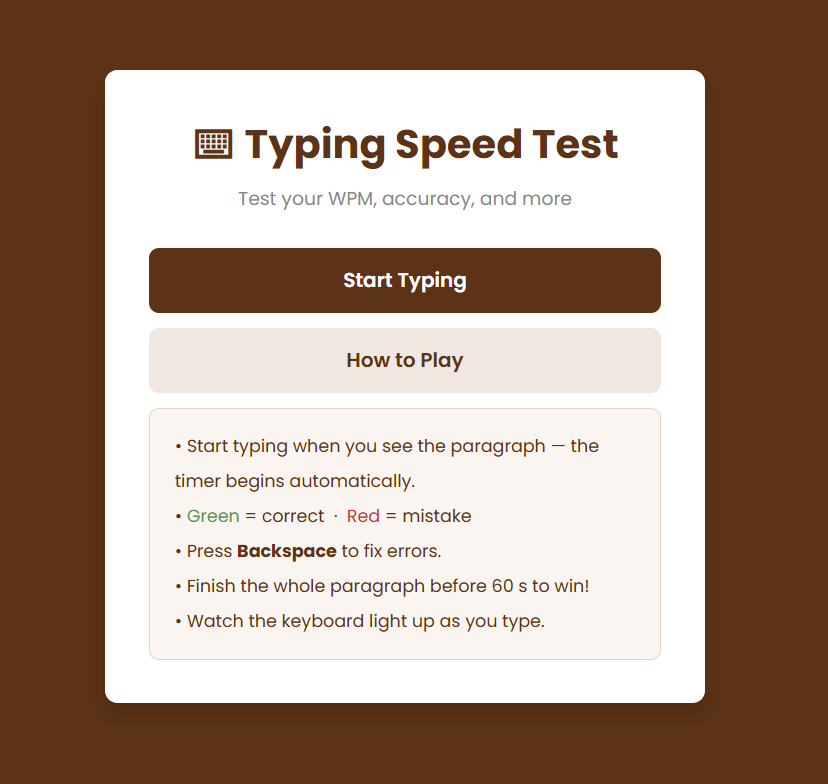
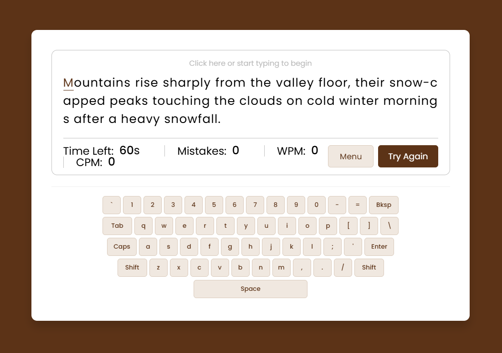
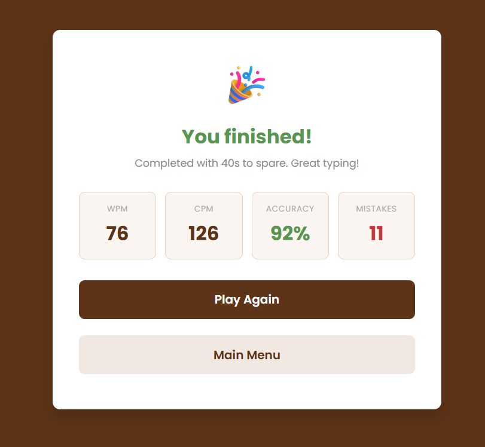
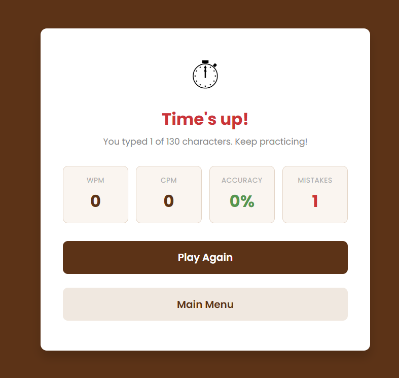

# ⌨️ Typing Speed Test

A browser-based typing speed test game built with vanilla HTML, CSS, and JavaScript. Test your WPM, track your accuracy, and watch the keyboard light up as you type, all with no frameworks or dependencies required.

<p align="center">
  
</p>

<p align="center">
  <a href="https://ajunabia228.github.io/typing-speed-game/">
    
  </a>
</p>

---

## 🎮 Features

<p align="center">
  
</p>

- **Main menu** — Start screen with a "How to Play" toggle so new players can learn the rules before diving in.
- **Live stats** — Real-time display of Time Left, WPM (Words Per Minute), CPM (Characters Per Minute), and Mistakes as you type.
- **Color-coded feedback** — Correct characters turn green, incorrect characters turn red with a pink highlight. A blinking brown underline marks your current position.
- **Backspace support** — Erase and correct mistakes mid-paragraph; the mistake counter adjusts accordingly.
- **On-screen keyboard** — A full QWERTY keyboard rendered below the text lights up each key as you press it, giving visual feedback on every keystroke.
- **60-second countdown** — The timer starts the moment you begin typing.
- **Win condition** — Finish the full paragraph before time runs out and you're taken to a congratulations screen.
- **Game over screen** — If time expires before you finish, a game over screen appears with your final stats.
- **End-screen stats** — Both outcome screens display final WPM, CPM, Accuracy %, and total Mistakes.
- **Random paragraphs** — A pool of 10 paragraphs is randomly selected each round for replayability.
- **Responsive design** — Layouts adapt cleanly to smaller screens and mobile viewports.

---

## 🖥️ Tech Stack

| Technology | Role |
|---|---|
| **HTML5** | Page structure and screen layout |
| **CSS3** | Styling, animations (blinking cursor, key press), responsive breakpoints |
| **Vanilla JavaScript** | Game logic, keyboard rendering, timer, stat calculations |
| **Google Fonts — Poppins** | Typography |

There are no frameworks, build tools, or dependencies beyond a Google Fonts import 💻

---

## 📁 Project Structure

```
typing-speed-test/
├── index.html          # All three screens: menu, game, end
├── style.css           # Full styling including keyboard and end screen
└── js/
    ├── paragraphs.js   # Array of 10 typing paragraphs
    └── script.js       # All game logic, keyboard, screen switching
```

---

## 🚀 Getting Started

To play locally, please follow the instructions below 🤔

1. Clone or download the repository:
   ```bash
   git clone https://github.com/YOUR_USERNAME/typing-speed-test.git
   ```
2. Open `index.html` in any modern browser - no server or install required.

---

## 🎯 How to Play

1. Click **Start Typing** from the main menu
2. Begin typing the displayed paragraph (the timer starts automatically)
3. Use **Backspace** to fix mistakes
4. Finish the paragraph within 60 seconds to win
5. View your final WPM, CPM, accuracy, and mistake count on the results screen
6. Click **Play Again** or return to the **Main Menu** to reset

If you successfully typed the paragraph before the timer ends, you beat the game!

<p align="center">
  
</p>

But if you weren't able to type the paragraph, you lost the game!

<p align="center">
  
</p>

---

## 📐 WPM Formula

WPM is calculated using the standard 5-characters-per-word convention:

```
WPM = ((characters typed - mistakes) / 5) / elapsed seconds × 60
```

Accuracy is calculated as:

```
Accuracy = ((characters typed - mistakes) / characters typed) × 100
```

---

## 🎨 Customization

| What | Where | How |
|---|---|---|
| Timer duration | `js/script.js` | Change `maxTime = 60` |
| Add paragraphs | `js/paragraphs.js` | Add strings to the `paragraphs` array |
| Change color theme | `style.css` | Replace `#5C3317` with any hex color |

---

## 📜 Credits

- **Original concept & base code:** [Yaswanth Teja Yarlagadda](https://github.com/yaswanthteja/Typing-speed-test) developed the foundational typing game logic, HTML structure, and CSS layout
- **Extended & modified by Antonio Unabia:** added main menu, on-screen keyboard, win/lose end screens with full stat breakdowns, brown theme, and expanded paragraph pool
- **Font:** [Poppins](https://fonts.google.com/specimen/Poppins) via Google Fonts (SIL Open Font License)

---

## 📄 License

This project is open source and available under the [MIT License](LICENSE).
